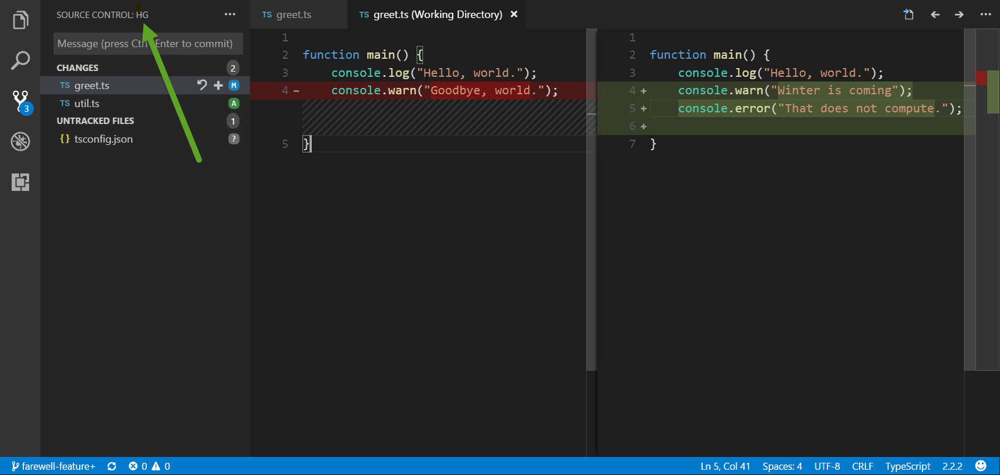
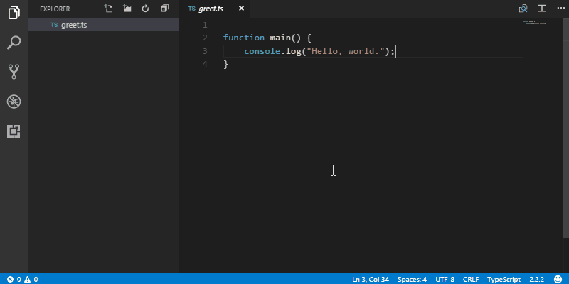
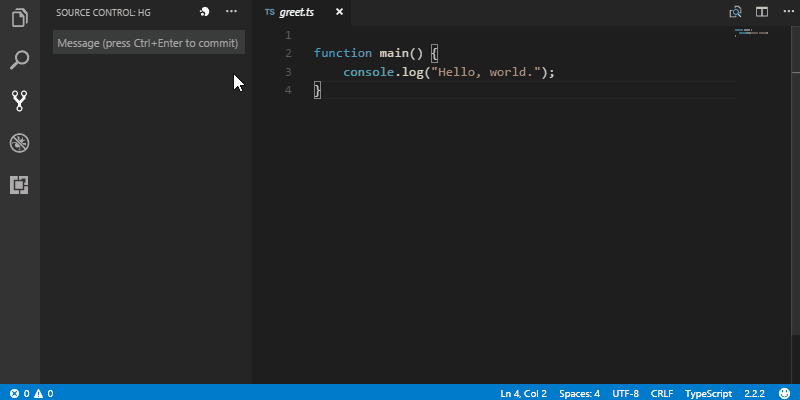
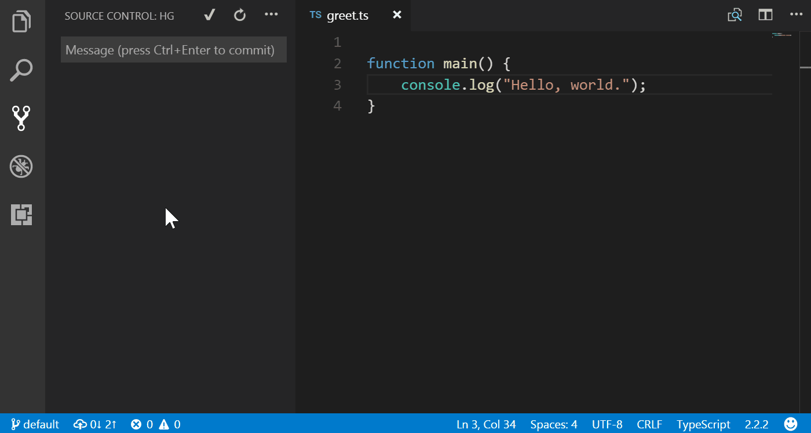

# Overview

### _Integrated_ Mercurial source control, using the new SCM API in VS Code 1.11+

 

# Features

 * Add files and commit from the source control side-bar (i.e. where git normally appears).

 * All the basics: commit, add, forget, update, push and pull. 

 * See changes inline within text editor. 

 * Interactive log for basic file history and diff.

 * Branch, merge heads, merge with branch, resolve + unresolve files.

 * Quickly switch branches, push and pull via status bar.

 * Automatic incoming/outgoing counters. 

 * Undo/rollback.

# Feedback & Contributing

 * This is a relatively **new** extension, _so_...
 * Please report any bugs, suggestions or documentation requests via the Github issues page (_yes_, I know it's ironic).
 * Feel free to submit pull requests.

# Getting Started

> **Note**: This extension leverages your 
> machine's Mercurial (hg) installation,  
> so you need to [install Mercurial](https://www.mercurial-scm.org) first. 

## Switch to Hg

 1. Open the source control side-bar.

 1. Click **⋯** > _Switch SCM Provider..._

 1. Choose _Hg_

## Initialize a new repo

 

  * Just click the Mercurial icon from the source control title area:

## Update to a branch/tag

  * The current branch name is shown in the bottom-left corner.
  * Click it to see a list of branches and tags that you can update to.

## Settings

`hg.enabled { boolean }`
  * Enables Hg as a source control manager in VS Code.

`hg.path { string | null }`
  * Specifies an explicit `hg` file path to use.
  * This should only be used if `hg` cannot be found automatically.
  * The default behaviour is to search for `hg` in commonly-known install locations and on the PATH.
  
`hg.autoInOut { boolean }`
  * Enables automatic counting of incoming/outgoing changes.
  * When enabled, these show in the status bar.
  * Updated every 3 minutes, or whenever a commit/push/pull is done.
  
`hg.autoRefresh { boolean }`

  * Enables automatic refreshing of Source Control tab and badge counter when files within the project change:  
  `"true"` &mdash; enabled  
  `"false"` &mdash; disabled, manual refresh still available.
    
`hg.countBadge { tracked | all | off }`
  * Controls the badge counter for Source Control in the activity bar:  
  `"tracked"` &mdash; only count changes to tracked files (default).  
  `"all"` &mdash; include untracked files in count.  
  `"off"` &mdash; no badge counter.
  
`hg.allowPushNewBranches { boolean }`
  * Overrides the warning that normally occurs when a new branch is pushed:  
  `"true"` &mdash; new branches are pushed without warning (default).  
  `"false"` &mdash; shows a prompt when new branches are being pushed (e.g `hg push --new-branch`)
  
`hg.commandMode`
  * Controls the method used to communicate with `hg`.
  * Normally, there is a noticeable start-up performance cost with repeatedly running `hg` commands.
  * By running a [command server](https://www.mercurial-scm.org/wiki/CommandServer) process in the background, frequently-used commands run ~10× faster (e.g. `cat`, `status`, `summary`, `branch` etc.)  
  `"server"` &mdash; run a command server process (default) &nbsp;_i.e. `hg serve --cmdserve`_  
  `"cli"` &mdash; spawn a new `hg` process per command.
